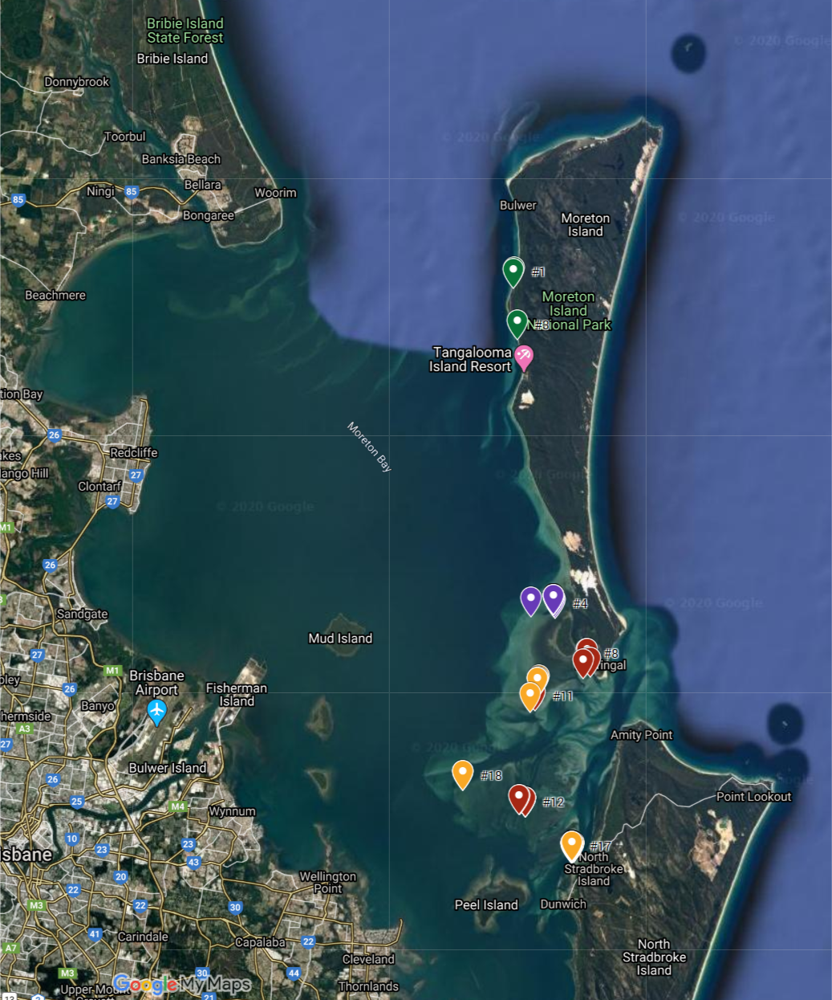

# Repository for DeepSeagrass Dataset, Training Models and Original Paper.

The official repository for the paper: Multi-species Seagrass Detection and Classification from Underwater Images

This repository provides the steps and code to train and deploy deep learning models for detection and classification of multiple species of seagrass from underwater images.  It also contains our 'DeepSeagrass' dataset, codes and pre-trained models.

## Paper
Our approach contributes to the field of automated seagrass detection by distinguishing between different types of seagrass and classifying seagrass on a per-patch basis.  This approach also provides location information about the seagrass in the frame without the need for dense pixel, polygon or bounding box labels.
```
ARXIV REFERENCE HERE (2020). Multi-species seagrass detection and classification from underwater images. 
```

## DeepSeagrass
Images were acquired across nine different seagrass beds in Moreton Bay, over four days during February 2020. Search locations were chosen according to distributions reported in the publicly available dataset. A biologist made a search of each area, snorkelling in approximately 1m of water during low to mid tide. In-situ search of seagrass beds resulted in 78 distinct geographic sub-areas, each containing one particular seagrass morphotype (or bare substrate).  Images were taken using a Sony Action Cam FDR-3000X from approximately 0.5m off the seafloor at an oblique angle of around 45 degrees. Over 12000 high-resolution (4624 x 2600 pixels) images were obtained. 
 

 
## Preparing the Dataset
It is assumed that the images used are 4624 x 2600 pixels.  The dataset is first prepared by dividing each image into a grid of 5 rows and 8 columns - this yields patches of 578 x 520 pixels for training. The training and validation datasets are also created at this stage.

## Setup
We suggest using the Annaconda package manager to install dependencies.

1. Download Anaconda
2. Create a coda environment: conda create -n deepseagrass pip
3. Activate the environment: conda activate deepseagrass
4. Install tensorflow: pip install tensorflow
5. Install opencv: conda install opencv
6. Install imgaug: pip install imgaug
7. Install sklearn: pip install sklearn
8. Install matplotlib: pip install matplotlib
9. Clone the adaptive learning rate scheduler and rolling buffer files from: https://github.com/microfossil/particle-classification/blob/master/miso/training/adaptive_learning_rate.py

## Train the Model
The approach takes the pre-trained weights of VGG16 on the ImageNet classification task.  The final Dense layers are removed and replaced with a decoder module trained on the DeepSeagrass dataset.  It is possible to deploy our trained model for inference or use our training script to train on a dataset of your own patches. 

Run the training script using:

```python train.py```

You can alter the number of classes and the batch size, for example:

```python train.py --batch_size=32 --num_classes=4```

A csv file is generated to store relevant class-specific metrics from training.  The model is saved as save.tf.
The script assumes that the training images are stored in the following file structure, where the folder names act as the image patch labels.  The script will automatically randomly assign 80% of these images for training the model and 20% for validation.
```
    train
    ├── Strappy
    │   ├── Image0_Row1_Col0.jpg
    │   ├── Image0_Row1_Col1.jpg
    │   ├── Image0_Row1_Col2.jpg
    │   ├── .
    │   ├── .
    ├── Ferny
    │   ├── Image1_Row1_Col0.jpg
    │   ├── Image1_Row1_Col1.jpg
    │   ├── Image1_Row1_Col2.jpg
    │   ├── .
    │   ├── .
    ├── Rounded
    │   ├── Image50_Row1_Col0.jpg
    │   ├── Image50_Row1_Col1.jpg
    │   ├── Image50_Row1_Col2.jpg
    │   ├── .
    │   ├── .
    └── Background
        ├── Imag2679e_Row1_Col0.jpg
        ├── Image2679_Row1_Col1.jpg
        ├── Image2679_Row1_Col2.jpg
        ├── .
        └── .
```

## Evaluate the Model
The trained model can be reloaded and used on a test dataset using:

```python evaluate_model.py --num_classes=4``` 

This script has three optional flags which can be used to change the output of the script:

```python evaluate_model.py --num_classes=4 --metrics=True --save_incorrect=True --visualise_inferences=True```

If the metrics flag is true, then a class-wise confusion matrix and accuracy metrics will be printed.  The save_incorrect flag can be used to save patches which are incorrectly classified.  When the patch is saved, the correct label and the inferred label are recorded in the name of the image.  If visualise_inferences is true, then the model can be used on a folder of whole images.  In this case, the script will infer on patches in the image and then an output image in which the class is visualised as a colour mask on the original image.  Yellow is for the strappy class, blue is used for the rounded class, red is used for the ferny class and pink represents background.

For example:


The file structure is the same as for training (above), except that test patches are stored in a folder called 'test'.  If you intend to use the script to infer on whole images, these images should be stored in another folder called 'test_visualisations'.

## Pre-Trained Models
The best performing model reported in our paper is provided.  This model is trained to infer on image patches of 578 x 520 pixels.  Additionally, we provide the best performing model for a patch size of 289 x 260 pixels.  We found that there was an improvement in the accuracy when the 'Background' class was divided into 'Water' column and 'Substrate'.  We additionally provide a pre-trained model for this 5-class case. Th 5-class model is only provided for 578 x 520 pixel patches.  The pre-trained models can be downloaded [here] (https://cloudstor.aarnet.edu.au/plus/s/nQ6JRNYvKaGqfaE). 
